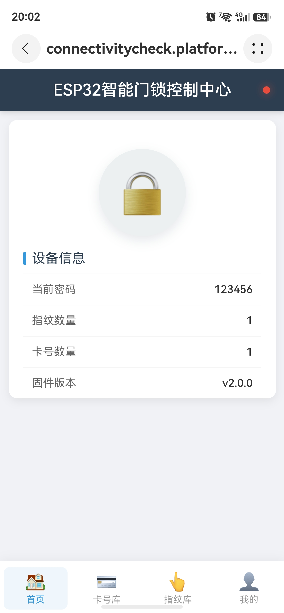
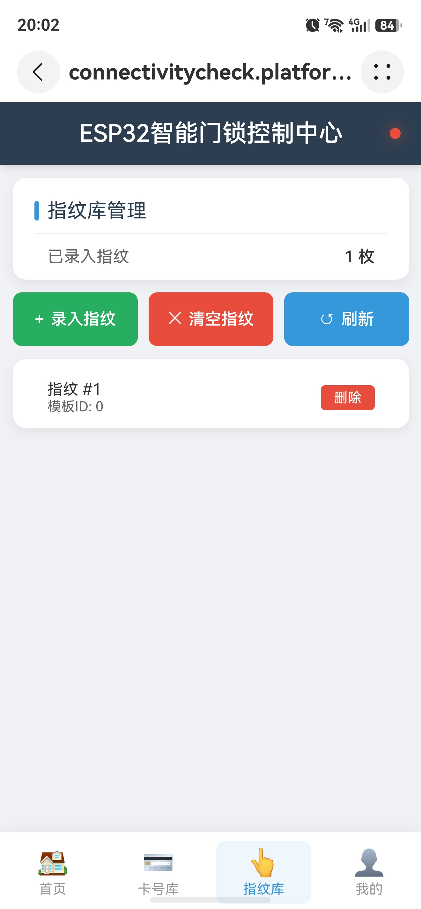

基于ESP-IDF设计并实现一套低功耗智能门锁系统，集成指纹、密码、IC卡及远程控制四种解锁方式。系统支持本地离线控制与云端物联网接入，通过MQTT协议对接平台，并结合微信小程序实现远程开锁与状态监控。

- 基于ESP-IDF构建多任务架构，使用FreeRTOS实现任务调度、队列通信与信号量同步

- 设计低功耗运行机制，支持定时休眠+外设中断唤醒（指纹/刷卡/触摸）

- 集成指纹模块和刷卡和触摸模块等多外设通信，并实现统一事件管理

- 基于MQTT实现设备与云端双向通信，支持远程控制与状态上报

- 搭建本地AP模式+Web页面，实现无网络环境下的设备管理

- 开发微信小程序，实现远程开锁、实现指纹、密码、卡片的添加、删除与修改功能

实现多种解锁方式融合，系统响应时间<20ms，设备稳定运行，支持长时间低功耗待机，优化功耗到2mA，完成从硬件设计、嵌入式开发到前端交互的完整闭环开发。

